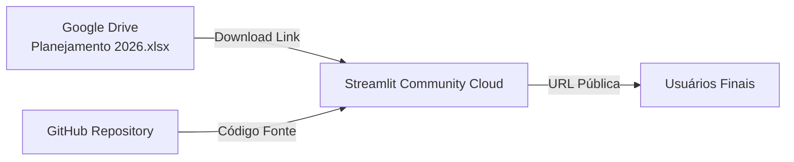

# Guia de Implantação Simples e Pública — Hanzo do Brasil

Este guia explica como implantar publicamente o Dashboard da Hanzo do Brasil utilizando o **GitHub**, o **Streamlit Community Cloud** e o **Google Drive** como fonte de dados em nuvem. 

Seguindo estes passos, você terá um link público seguro que qualquer pessoa fora da sua organização poderá acessar sem necessidade de instalações, logins ou contas empresariais.

---

## 📂 Visão Geral da Arquitetura


---

## 1. Como Preparar e Hospedar os Dados no Google Drive

Para disponibilizar a planilha online sem exigir login ou permissões complexas:

1. **Upload da Planilha**:
   * Acesse o seu [Google Drive](https://drive.google.com).
   * Faça o upload do arquivo `Planejamento 2026.xlsx` para uma pasta de sua escolha.
   
2. **Configuração de Compartilhamento Público**:
   * Clique com o botão direito no arquivo no Google Drive e selecione **Compartilhar** > **Compartilhar**.
   * Em *Acesso geral*, mude de *Restrito* para **Qualquer pessoa com o link**.
   * Certifique-se de que a função ao lado esteja definida como **Leitor**.
   * Clique em **Concluir**.

3. **Como Copiar o ID do Arquivo (File ID)**:
   * Clique em **Copiar link** na tela de compartilhamento do arquivo.
   * O link copiado terá este formato:
     `https://drive.google.com/file/d/1A2B3C4D5E6F7G8H9I0J_KLMNOPQRSTUVWXYZ/view?usp=sharing`
   * O **ID do Arquivo** é o código alfanumérico que fica entre `/d/` e `/view`. No exemplo acima, o ID é:
     `1A2B3C4D5E6F7G8H9I0J_KLMNOPQRSTUVWXYZ`
   * Copie este código.

---

## 2. Como Configurar o ID do Arquivo no Dashboard

1. Abra o arquivo [app.py](app.py) do seu projeto.
2. Localize a variável `GOOGLE_DRIVE_FILE_ID` nas primeiras linhas do código:
   ```python
   GOOGLE_DRIVE_FILE_ID = "paste_file_id_here"
   ```
3. Substitua o texto `"paste_file_id_here"` pelo ID que você copiou no passo anterior.
   * Exemplo:
     ```python
     GOOGLE_DRIVE_FILE_ID = "1A2B3C4D5E6F7G8H9I0J_KLMNOPQRSTUVWXYZ"
     ```
4. Salve o arquivo.

---

## 3. Como Enviar o Projeto para o GitHub

1. Crie um repositório no seu [GitHub](https://github.com):
   * Nomeie como desejar (ex: `hanzo-dashboard`).
   * Deixe o repositório como **Public** ou **Private** (ambos funcionam no Streamlit Cloud).
   * **Não** selecione a opção de criar README, `.gitignore` ou licença (pois usará os arquivos locais).

2. Abra o terminal (PowerShell) no diretório do projeto e execute os comandos:
   ```powershell
   # Inicializar repositório Git
   git init

   # Adicionar arquivos
   git add .

   # Realizar o primeiro commit
   git commit -m "feat: configuracao de deploy publico com google drive"

   # Vincular ao GitHub (Substitua a URL pelo link do seu repositório criado)
   git remote add origin https://github.com/SEU_USUARIO/SEU_REPOSITORIO.git

   # Enviar código para o branch principal
   git branch -M main
   git push -u origin main
   ```

---

## 4. Como Hospedar no Streamlit Community Cloud

O Streamlit Community Cloud é um serviço de hospedagem gratuito oficial do Streamlit.

1. Acesse [share.streamlit.io](https://share.streamlit.io) e clique em **Sign in** (conecte utilizando sua conta do GitHub).
2. Clique no botão **Create app** no canto superior direito.
3. Preencha as configurações do deploy:
   * **Repository**: Selecione seu repositório recém-criado (ex: `SEU_USUARIO/SEU_REPOSITORIO`).
   * **Branch**: Defina como `main`.
   * **Main file path**: Digite `app.py`.
   * **URL** (Opcional): Você pode personalizar a URL pública do app (ex: `https://hanzo-dashboard.streamlit.app`).
4. Clique em **Deploy!**

Pronto! Em poucos minutos, a plataforma lerá o arquivo `requirements.txt`, instalará as dependências e o dashboard estará no ar.

---

## 5. Como Atualizar os Dados do Dashboard no Futuro

Para atualizar os números ou adicionar novos dados no painel, **você não precisa fazer nenhuma alteração de código ou git push**.

* Basta abrir o Google Drive, clicar com o botão direito no arquivo `Planejamento 2026.xlsx` existente e escolher **Gerenciar Versões** > **Fazer upload de nova versão** para substituir o arquivo antigo.
* Ou, alternativamente, abra o arquivo no Google Drive, faça as edições diretas e salve.
* No dashboard público, clique no botão **🔄 Atualizar Dados** na barra lateral. O painel baixará a versão mais recente do Google Drive imediatamente.

---

## 🔒 Segurança e Acesso
* **Sem Contas ou Logins**: O dashboard não exige autenticação. Qualquer usuário com o link público poderá ver os dados.
* **Apenas Leitura**: O dashboard apenas lê os dados do Google Drive. Usuários do painel não conseguem modificar seu arquivo original do Drive.
